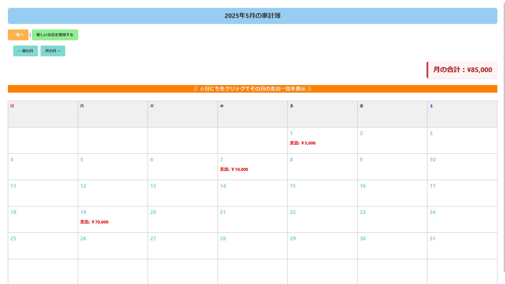

# カレンダー家計簿アプリ（Docker対応）

このアプリは、**カレンダー形式で支出を管理できる家計簿アプリ**です。日ごとの支出、月ごとの合計金額を一目で確認できるよう設計されています。

## コミット履歴について

※過去にコミット履歴を整理するために rebase を使った影響で、一部の履歴が少し分かりづらくなっています。
今後は rebase に頼らず、初めから見通しのよい履歴になるよう心がけていきます。

## デプロイ先

以下のサービスでデプロイ済みです。

- Railway: [https://expensecalendar-production.up.railway.app/](https://expensecalendar-production.up.railway.app/)

## 主な機能

- ✅ ユーザー登録・ログイン機能（セキュリティ対応済）
- ✅ 支出の登録・編集・削除
- ✅ 支出ジャンルの分類
- ✅ **カレンダー表示による日別支出の可視化**
- ✅ 月ごとの合計支出表示
- ✅ 入力バリデーション（不正な入力防止）

## 使用技術

| 種類       | 技術                           |
|------------|--------------------------------|
| バックエンド | Spring Boot (Java)            |
| フロントエンド | Thymeleaf, HTML, CSS           |
| データベース | PostgreSQL                    |
| ORM        | MyBatis                        |
| ビルド     | Gradle / Docker                        |
| デプロイ   | Railway   |

## ER図

以下は本アプリケーションのデータベース構成を示したER図です（DBeaverにて作成）。


## 画面サンプル

| ログイン画面 | カレンダー表示画面 |
|---------------|----------------------|
|  |  |

## テスト用アカウント（ログイン情報）

本アプリには、あらかじめテスト用アカウントを用意しています。  
ログインしてすぐに機能を試していただけます。
（新規登録では入力バリデーションを含む挙動を確認できます）

- ユーザー名：`demo`
- パスワード：`demo`

## セットアップ手順（Docker）

1. このリポジトリをクローンします。

    ```bash
    git clone https://github.com/ktr0203ozeken/expensecalendar.git
    cd expensecalendar
    ```

2. PostgreSQL を起動し、必要なデータベースとユーザーを作成します。

    ```
    データベース名：expensecalendar_db
    ユーザー名：your_user
    パスワード：your_password
    ```

3. `.env.example` をもとに `.env` を作成します。
    
    ```bash
    cp .env.example .env
    nano .env # or your favorite editor
    ```

4. Docker コンテナをビルド＆起動します。

    ```bash
    docker compose --env-file .env up
    ```

5. ブラウザで以下にアクセスしてアプリを確認します。

    [http://localhost:8080](http://localhost:8080)

## データベース初期化

`schema.sql` にてテーブルが自動生成されます。

```sql
--ユーザーテーブルを作成
CREATE TABLE IF NOT EXISTS users (
    id       SERIAL PRIMARY KEY,          -- ID
    username VARCHAR(50) NOT NULL UNIQUE, -- ユーザー名
    password VARCHAR(255) NOT NULL,       -- パスワード
    role     VARCHAR(20) DEFAULT 'USER'   -- 権限
);

-- ジャンルテーブルを追加
CREATE TABLE IF NOT EXISTS genres (
    id   SERIAL PRIMARY KEY,      -- ID
    name VARCHAR(50) NOT NULL     -- ジャンル名
);

-- 支出テーブルを作成
CREATE TABLE IF NOT EXISTS expenses (
    id          BIGSERIAL PRIMARY KEY,           -- ID
    user_id     INTEGER NOT NULL,                -- ユーザーID（外部キー）
    date        DATE NOT NULL,                   -- 日付
    genre_id    INTEGER NOT NULL,                -- ジャンルID（外部キー）
    amount      BIGINT NOT NULL,                 -- 金額
    description TEXT,                            -- 説明
    CONSTRAINT fk_user FOREIGN KEY (user_id) REFERENCES users(id) ON DELETE CASCADE,
    CONSTRAINT fk_genre FOREIGN KEY (genre_id) REFERENCES genres(id)
);
```