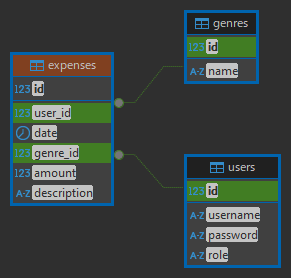

# カレンダー家計簿アプリ

このアプリは、**カレンダー形式で支出を管理できる家計簿アプリ**です。日ごとの支出、月ごとの合計金額を一目で確認できるよう設計されています。

## コミット履歴について

※過去にコミット履歴を整理するために rebase を使った影響で、一部の履歴が少し分かりづらくなっています。
今後は rebase に頼らず、初めから見通しのよい履歴になるよう心がけていきます。

## デプロイ先

以下のサービスでデプロイ済みです。

- Heroku: [https://expense-calendar-app-6a9c24a693ce.herokuapp.com/](https://expense-calendar-app-6a9c24a693ce.herokuapp.com/)
- Railway: [https://expensecalendar-production.up.railway.app/](https://expensecalendar-production.up.railway.app/)

## 主な機能

- ✅ ユーザー登録・ログイン機能（セキュリティ対応済）
- ✅ 支出の登録・編集・削除
- ✅ 支出ジャンルの分類
- ✅ **カレンダー表示による日別支出の可視化**
- ✅ 月ごとの合計支出表示
- ✅ 入力バリデーション（不正な入力防止）

## 使用技術

| 種類       | 技術                           |
|------------|--------------------------------|
| バックエンド | Spring Boot (Java)            |
| フロントエンド | Thymeleaf, HTML, CSS           |
| データベース | PostgreSQL                    |
| ORM        | MyBatis                        |
| ビルド     | Gradle                         |
| デプロイ   | Heroku / Railway   |

## ER図

以下は本アプリケーションのデータベース構成を示したER図です（DBeaverにて作成）。



## 画面サンプル

| ログイン画面 | カレンダー表示画面 |
|---------------|----------------------|
|  |  |

## テスト用アカウント（ログイン情報）

本アプリには、あらかじめテスト用アカウントを用意しています。  
ログインしてすぐに機能を試していただけます。
（新規登録では入力バリデーションを含む挙動を確認できます）

- ユーザー名：`demo`
- パスワード：`demo`

## セットアップ手順（ローカル環境）

1. このリポジトリをクローン

    ```bash
    git clone https://github.com/ktr0203ozeken/expensecalendar.git
    cd expensecalendar
    ```

2. PostgreSQL を起動し、必要なデータベースを作成してください。

    ```
    データベース名：expensecalendar_db
    ユーザー名：your_user
    パスワード：your_password
    ```

3. `src/main/resources/application-dev.properties` を新規作成し、DB接続設定を記入

    ```properties
    spring.sql.init.mode=always
    spring.datasource.url=jdbc:postgresql://localhost:5432/expensecalendar_db
    spring.datasource.username=your_user
    spring.datasource.password=your_password
    ```

4. 開発プロファイルを指定（以下いずれか）

   - 起動時に VM 引数で指定（Eclipse/IntelliJ）

     ```
     -Dspring.profiles.active=dev
     ```

   - または `src/main/resources/application.properties` を新規作成し、以下を追加

     ```properties
     spring.profiles.active=dev
     ```

5. アプリケーションを起動

    ```bash
    ./gradlew bootRun
    ```

6. ブラウザで `http://localhost:8080` にアクセス  

## データベース初期化

`schema.sql` にてテーブルが自動生成されます。

```sql
--ユーザーテーブルを作成
CREATE TABLE IF NOT EXISTS users (
    id SERIAL PRIMARY KEY,
    username VARCHAR(50) NOT NULL UNIQUE,
    password VARCHAR(255) NOT NULL,
    role VARCHAR(20) DEFAULT 'USER'
);

-- ジャンルテーブルを追加
CREATE TABLE IF NOT EXISTS genres (
    id SERIAL PRIMARY KEY,
    name VARCHAR(50) NOT NULL
);

-- 支出テーブルを作成
CREATE TABLE IF NOT EXISTS expenses (
    id          BIGSERIAL PRIMARY KEY,           -- ID
    user_id     INTEGER NOT NULL,                -- ユーザーID（外部キー）
    date        DATE NOT NULL,                   -- 日付
    genre_id    INTEGER NOT NULL,                -- ジャンルID（外部キー）
    amount      BIGINT NOT NULL,                 -- 金額
    description TEXT,                            -- 説明
    CONSTRAINT fk_user FOREIGN KEY (user_id) REFERENCES users(id) ON DELETE CASCADE,
    CONSTRAINT fk_genre FOREIGN KEY (genre_id) REFERENCES genres(id)
);
```